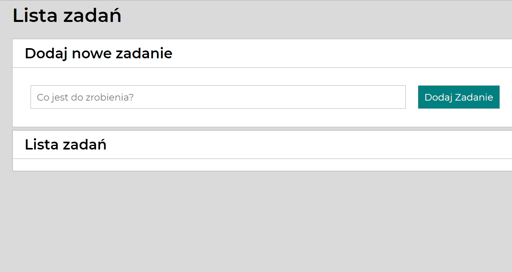

# Task-List
## Demo: [Tasks](https://dorota87kmiecik.github.io/TasksList/)

## On this page are used the basics 
- JS
- CSS
- HTML 
## This page is for providing your tasks list
### Here is the user manual:

1. First write the task you need to complete
2. Then click on "Dodaj zadanie" button
3. Click on the green button if your task is completed
4. Click on the red button if you want to delete your task. 

### See the presentation:

